# Markdown 学习手册 {ignore}

## 标题

- **使用 = 和 - 标记一级和二级标题**
  = 和 - 标记语法格式如下:

```
我展示的是一级标题
=================

我展示的是二级标题
-----------------
```

- **使用 # 号标记**
  使用 # 号可表示 1-6 级标题，一级标题对应一个 # 号，二级标题对应两个 # 号，以此类推。

```
# 一级标题
## 二级标题
### 三级标题
#### 四级标题
##### 五级标题
###### 六级标题
```

## 段落

- Markdown 段落没有特殊的格式，直接编写文字就好，**段落的换行是使用两个以上空格加上回车。**(行内换行)
  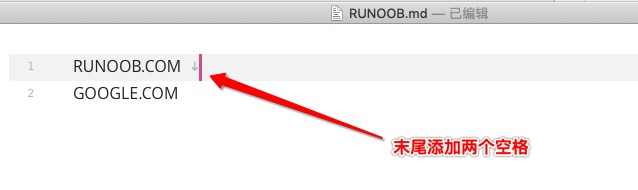

- 也可以**在段落后面使用一个空行**来表示重新开始一个段落。
  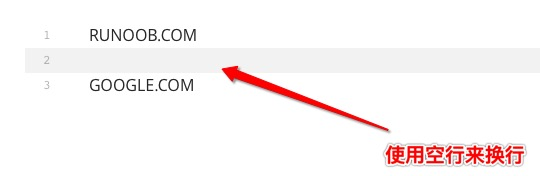

## 字体

Markdown 可以使用以下几种字体：

```
*斜体文本*
_斜体文本_
**粗体文本**
__粗体文本__
***粗斜体文本***
___粗斜体文本___
```

## 分隔线

你可以在一行中用**三个以上的星号、减号、底线来建立一个分隔线**，行内不能有其他东西。你也可以在星号或是减号中间插入空格。下面每种写法都可以建立分隔线：

```
***

* * *

*****

- - -

----------
```

显示效果如下所示：


## 删除线

如果段落上的文字要添加删除线，只需要**在文字的两端加上两个波浪线 ~~ 即可**，实例如下：

```
RUNOOB.COM
GOOGLE.COM
~~BAIDU.COM~~
```

显示效果如下所示：


## 下划线

下划线可以**通过 HTML 的 `<u>` 标签**来实现：

```
<u>带下划线文本</u>
```

显示效果如下所示：


## 脚注

脚注是对文本的补充说明。  
Markdown 脚注的格式如下:

```
[^要注明的文本]
```

以下实例演示了脚注的用法：

```
创建脚注格式类似这样 [^footnote]。

[^footnote]: 是可以附在文章页面的最底端的，对某些东西加以说明，印在书页下端的注文。脚注和尾注是对文本的补充说明。脚注一般位于页面的底部，可以作为文档某处内容的注释；尾注一般位于文档的末尾，列出引文的出处等。
```

演示效果如下：
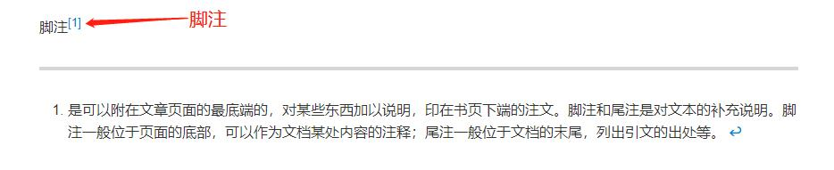

## 列表

Markdown 支持有序列表和无序列表。

### 无序列表

**无序列表使用星号(\*)、加号(+)或是减号(-)作为列表标记，这些标记后面要添加一个空格，然后再填写内容**：

```
* 第一项
* 第二项
* 第三项

+ 第一项
+ 第二项
+ 第三项


- 第一项
- 第二项
- 第三项
```

显示结果如下：


### 有序列表

**有序列表使用数字并加上 . 号来表示**，如：

```
1. 第一项
2. 第二项
3. 第三项
```

显示结果如下：


### 列表嵌套

列表嵌套只需**在子列表中的选项前面添加四个空格**即可：

```
1. 第一项：
    - 第一项嵌套的第一个元素
    - 第一项嵌套的第二个元素
2. 第二项：
    - 第二项嵌套的第一个元素
    - 第二项嵌套的第二个元素
```

显示结果如下：


## 区块

Markdown 区块引用是**在段落开头使用 > 符号 ，然后后面紧跟一个空格符号**：

```
> 区块引用
> 菜鸟教程
> 学的不仅是技术更是梦想
```

显示结果如下：


另外区块是可以嵌套的，**一个 > 符号是最外层，两个 > 符号是第一层嵌套，以此类推**：

```
> 最外层
> > 第一层嵌套
> > > 第二层嵌套
```

显示结果如下：


### 区块中使用列表

区块中使用列表实例如下：

```
> 区块中使用列表
> 1. 第一项
> 2. 第二项
> + 第一项
> + 第二项
> + 第三项
```

显示结果如下：


### 列表中使用区块

如果要在列表项目内放进区块，那么就需要**在 > 前添加四个空格的缩进**。  
区块中使用列表实例如下：

```
* 第一项
    > 菜鸟教程
    > 学的不仅是技术更是梦想
* 第二项
```

显示结果如下：


## 代码引用

### 代码片段

如果是段落上的一个函数或片段的代码可以**用反引号把它包起来（`）**，例如：

```
`printf()` 函数
```


### 代码区块

- 代码区块**使用 4 个空格或者一个制表符（Tab 键）**。
  实例如下：
  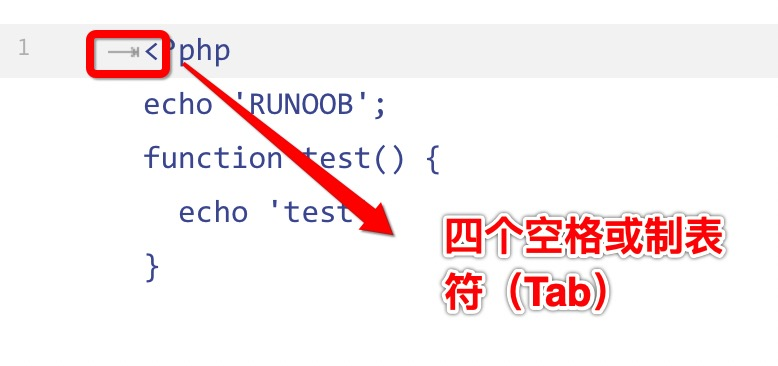

  显示结果如下：
  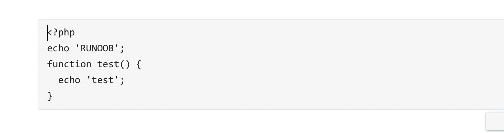

- 也可以**用 ``` 包裹一段代码，并指定一种语言（也可以不指定）**：
  实例如下：
  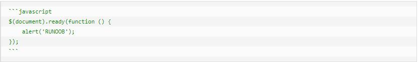

  显示结果如下：
  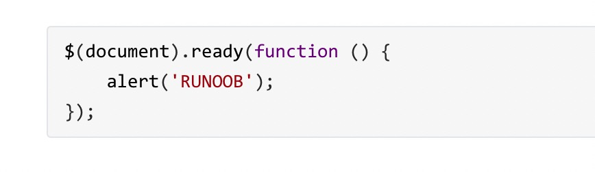

## 链接

### 链接名+链接地址

```
[链接名称](链接地址)
```

实例如下：

```
这是一个链接 [菜鸟教程](https://www.runoob.com)
```

显示效果如下：


### 直接使用链接地址：

```
<链接地址>
```

实例如下：

```
<https://www.runoob.com>
```

显示效果如下：


### 高级链接

我们可以通过变量来设置一个链接，变量赋值在文档末尾进行：
实例如下：

```
这个链接用 1 作为网址变量 [Google][1]
这个链接用 runoob 作为网址变量 [Runoob][runoob]
然后在文档的结尾为变量赋值（网址）

[1]: http://www.google.com/
[runoob]: http://www.runoob.com/
```

显示效果如下：
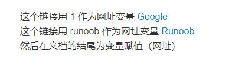

## 图片

- Markdown 图片语法格式如下：

1. 开头一个感叹号 !
2. 接着一个方括号，里面放上图片的替代文字
3. 接着一个普通括号，里面放上图片的网址，最后还可以用引号包住并加上选择性的 'title' 属性的文字。

```


```

实例如下：

```


```

显示效果如下：


- 当然，你也可以像网址那样对图片网址使用变量:
  实例如下：

```
这个链接用 1 作为网址变量 [RUNOOB][1].
然后在文档的结尾为变量赋值（网址）

[1]: http://static.runoob.com/images/runoob-logo.png
```

显示效果如下：


- Markdown 还没有办法指定图片的高度与宽度，如果你需要的话，你可以使用普通的 `` 标签。

```

```

显示效果如下：


## 表格

Markdown 制作表格**使用 | 来分隔不同的单元格，使用 - 来分隔表头和其他行。**

语法格式如下：

```
|  表头   | 表头  |
|  ----   | ----  |
| 单元格  | 单元格 |
| 单元格  | 单元格 |
```

显示效果如下：
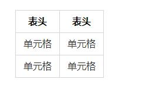

<u>我们可以设置表格的对齐方式</u>：

- -: 设置内容和标题栏居右对齐。
- :- 设置内容和标题栏居左对齐。
- :-: 设置内容和标题栏居中对齐。

实例如下：

```
| 左对齐左对齐| 右对齐右对齐 | 居中对齐居中对齐 |
| :----------| ----------: | :------------: |
| 单元格     |       单元格 |     单元格      |
| 单元格     |       单元格 |     单元格      |
```

以上代码显示结果如下：
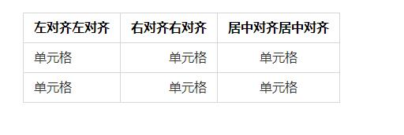

## 其他

- 添加目录：添加目录只需要在相应位置输入`[toc]`即可。
- 空格转义：在 Markdown 中使用空格需替换成 %20 即可。
- 其他 HTML 标签：不在 Markdown 涵盖范围之内的标签，都可以直接在文档里面用 HTML 撰写。
- 转义：Markdown 使用了很多特殊符号来表示特定的意义，如果需要显示特定的符号则需要使用转义字符，Markdown 使用反斜杠转义特殊字符：
- 公式：当你需要在编辑器中插入数学公式时，可以使用两个美元符 $$ 包裹 TeX 或 LaTeX 格式的数学公式来实现。提交后，问答和文章页会根据需要加载 Mathjax 对数学公式进行渲染。如：

```
$$
\frac{d}{dx}e^{ax}=ae^{ax}\quad \sum_{i=1}^{n}{(X_i - \overline{X})^2}
$$
```
- 在目录中忽略某个标题可在标题后面加一个空格后面```{ignore}```

以上代码显示结果如下：
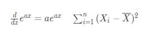

## MarkDown中使用注释

`*[symbol]:要注释的内容`或`[symbol]:要注释的内容`：其中`[]`中的符号可以自定义，但不能不填；这种注释在代码段无效，只能在外部使用。
例如：


## MarkDown为文字设置样式,添加背景色
- 使用表格+font标签添加
  ```
  <table>
  <tr>
  <td bgcolor="#f0f"> <font color="#fff" size=8 face="宋体">要写的文字 </ font></td>
  </tr>
  </table>
  ```
  - color:字体颜色，支持16进制和英文名
  - size：字体大小:1~7
  - face：字体样式
  - bgcolor: 背景颜色:支持16进制和英文名

- 使用mark标签+css添加
  ```
  春眠<mark style = "background-color:#0FFFFF;font-size:18px">不觉晓，</  mark>
  处处蚊子咬。
  ```


